## Material covered today

- what is meant by machine learning?
- dimensionality reduction methods: PCA, t-SNE and UMAP
- clustering

# What is machine learning? (At three levels of difficulty.)

## Level 1

```{r setup, include=FALSE}
knitr::opts_chunk$set(echo = TRUE)
library(tidyverse)
library(reshape2)
```

## Varieties (ignoring reinforcement learning)

```{r, echo = FALSE, out.width = "800px",fig.align="center",warnings=FALSE}
  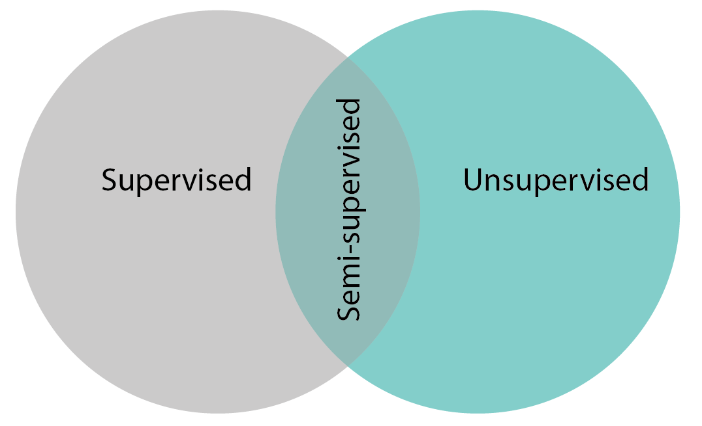
```

## Supervised: classification

```{r, echo = FALSE, out.width = "800px",fig.align="center"}
  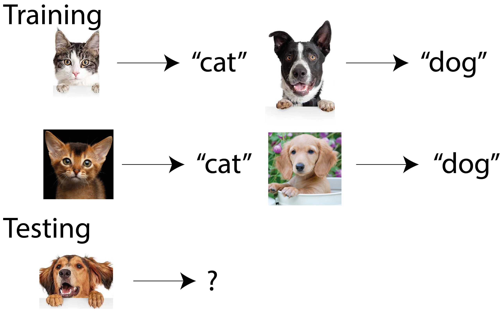
```

## Supervised: regression

```{r, echo = FALSE, out.width = "800px",fig.align="center"}
  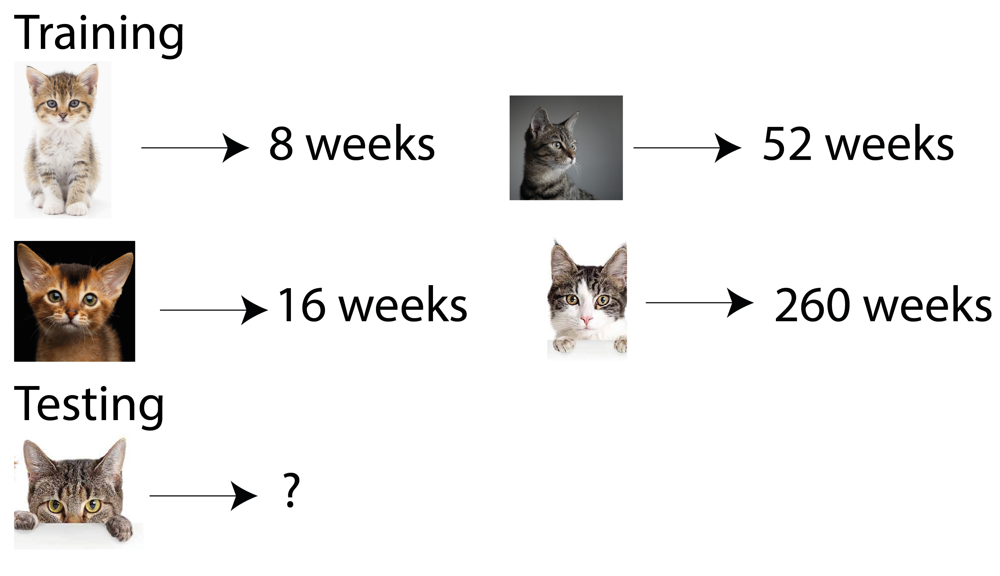
```

## Unsupervised: data

```{r, echo = FALSE, out.width = "600px",fig.align="center"}
  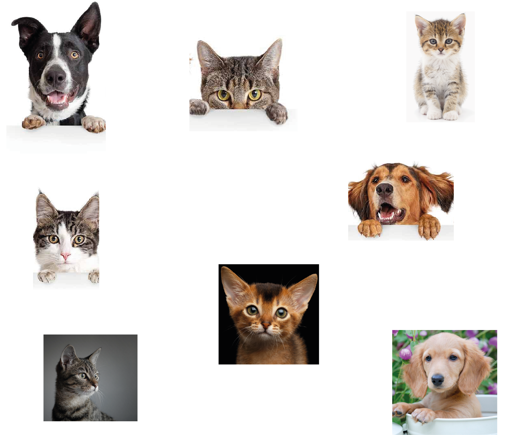
```

## Unsupervised: example result

```{r, echo = FALSE, out.width = "600px",fig.align="center"}
  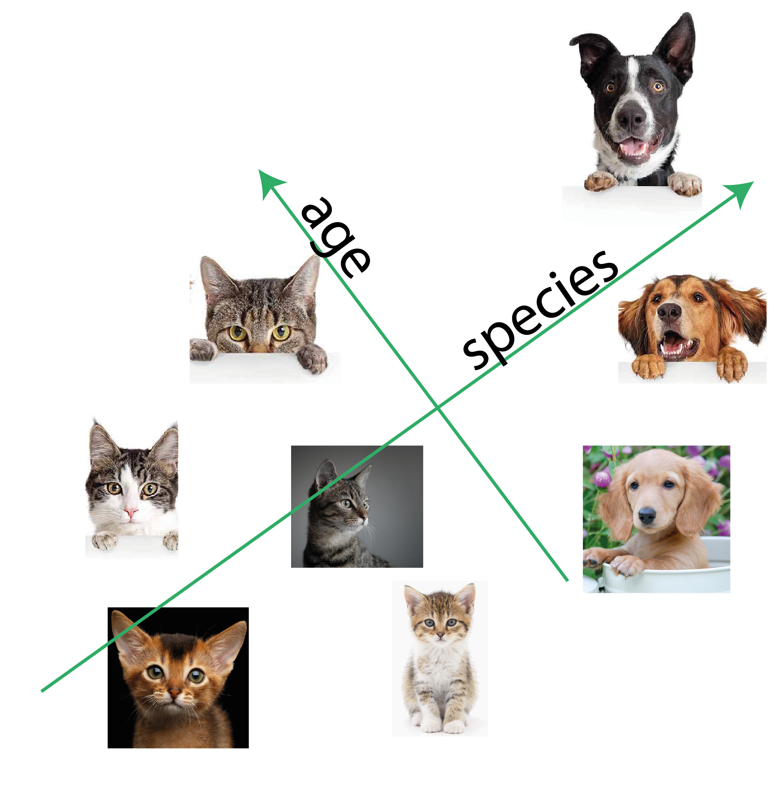
```

## Level 1: summary
Machine learning comes in two varieties:

- supervised learning:
    - typically lots of data-label pairs
    - aim is to build a model data -> label
    - categorical labels: classification
    - numeric labels: regression
- unsupervised learning:
    - unlabelled data
    - goals are vaguer but generally aims to simplify data and uncover patterns
    
## Level 2

## How does a computer "see" a cat?
```{r, echo = FALSE, out.width = "600px",fig.align="center"}
  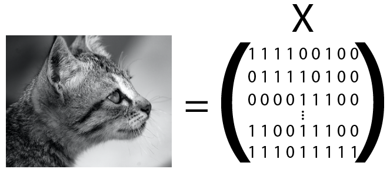
```

## How many images are possible?

- for a 20 x 20 binary image -> $X$ has dimensionality of 400
- $2^{400}\approx 2 \times 10^{120}$ possible images
- a very small proportion of those correspond to real world type images
- a very small proportion of real world images correspond to cats
- idea: even if dimensionality is big, effective dimensionality much lower
    - ML aims to find these lower dimensional representations

## Supervised learning

## Supervised learning
```{r, echo = FALSE, out.width = "600px",fig.align="center"}
  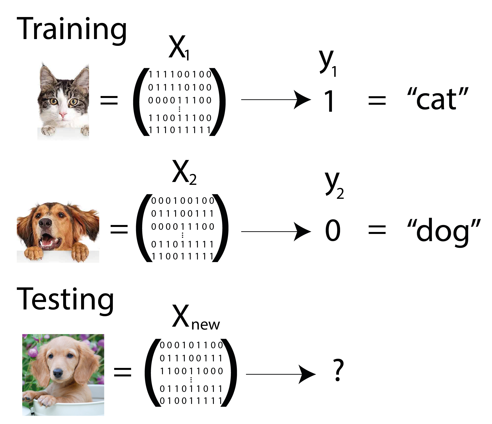
```

## Rule determination

- Hypothesis: there is a (fuzzy) rule $f: X \rightarrow y$
- Function may be complex and is controlled by low-dimensional parameters: $f=f(\theta)$
- Have training data: $(X_1, y_1)$, $(X_2, y_2)$, ..., $(X_n, y_n)$
- Can we learn $f$ by optimising $\theta$ on training data?
    - Due to low effective dimensionality of data: maybe

## What is  $\; f$?

- Linear combination of elements of $X$ (linear regression)
- Linear combination of functions of elements of $X$ (kernel regression)
- Regression trees (random forests, boosted regression)
- Non-linear combinations of elements, stacked into multiple layers (deep learning)

## How to learn  $\; f$?

- Define a cost of mismatch between $y_{i}^{\text{pred}}=f(X_i|\theta)$ and $y_{i}^\text{actual}$:

\begin{equation}
  C(f(X_i|\theta), \;y_{i}^\text{actual}) \geq 0.
\end{equation}

- For cat / dog example, we could do something like:
    - $C(1, 0) = C(0, 1) = 1$
    - $C(0, 0) = C(1, 1) = 0$

- Using training and testing data, choose:

\begin{equation}
\theta = \underset{\theta}{\operatorname{argmin}} \sum C(f(X_i|\theta), \;y_{i}^\text{actual}) + \lambda \left\lVert\theta\right\rVert,
\end{equation}

where $\lambda$ is some penalty for overfitting (more tomorrow)

## Unsupervised learning
  
## Unsupervised learning
```{r, echo = FALSE, out.width = "800px",fig.align="center"}
  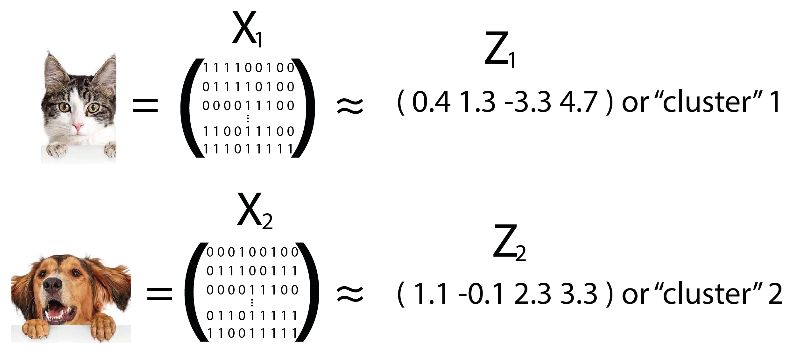
```

## Unsupervised learning: what does $Z$ capture?
```{r, echo = FALSE, out.width = "800px",fig.align="center"}
  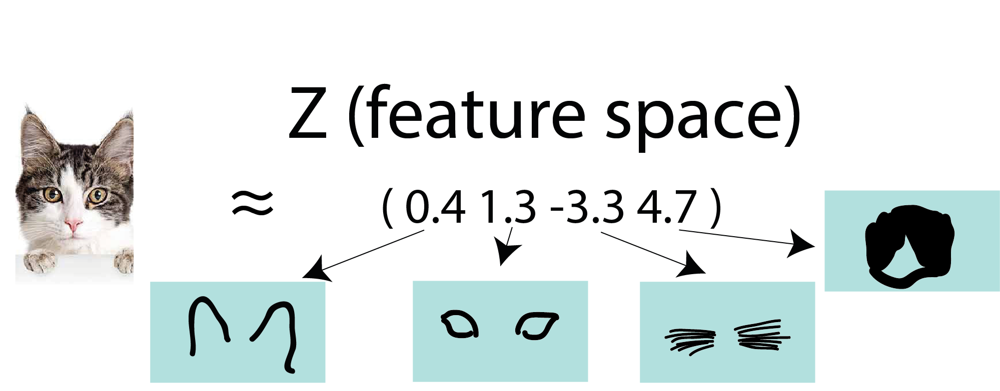
```

## Unsupervised learning: clustering
```{r, echo = FALSE, out.width = "800px",fig.align="center"}
  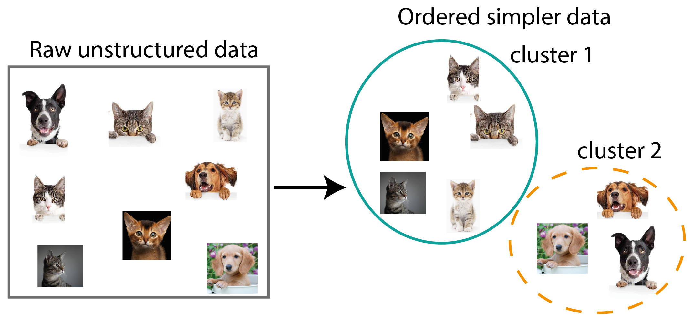
```

## Level 2: summary

- ML algorithms take numeric objects (vectors / matrices / tensors) as input
- intrinsic dimensionality of most things $<$ raw dimensions: world simpler
- supervised learning:
    - determines a mathematical function to predict outputs from inputs
    - function depends on parameters which must be learned using training / testing data
    - learning based on optimising cost function
    
## Level 2: summary
- unsupervised learning:
    - attempts to find more parsimonious representation of data
    - low dimensional variables learned may be more interpretable
    - clustering is an example of unsupervised ML
    
## Level 3

## Probabilistic interpretation

- observed data is generated by many processes
- most of these are unobserved or not understood
$\implies$ description of world should incorporate uncertainty

$\implies$ use language of probability

## Data generation
```{r, echo = FALSE, out.width = "800px",fig.align="center"}
  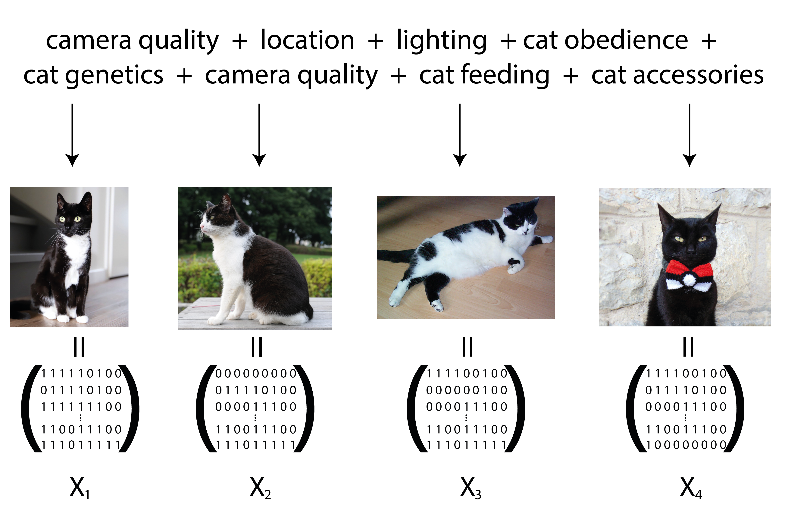
```

## Probabilistic representation

- image generation governed by:

\begin{equation}
p(X|\text{camera quality, location, cat genetics etc.)}.
\end{equation}

- don't observe camera quality, location, cat genetics and so on $\implies$ pictures drawn from:

\begin{equation}
p(X, \text{camera quality, location, cat genetics etc.})
\end{equation}

## Supervised learning

## Aim of supervised learning

- have training draws $(X_1, y_1)$, $(X_2, y_2)$, ..., $(X_n, y_n)$
- $\implies$ use these to learn $p(y|X)$ i.e. we want to do (Bayesian) inference
- learning $p(y|X)$ is hard but can often use low-dimensional approximation:

\begin{equation}
\widehat p_\theta(y|Z) \approx p(y|X), 
\end{equation}

where $Z$ are features of $X$

## Practical aim of supervised learning
```{r, echo = FALSE, out.width = "800px",fig.align="center"}
  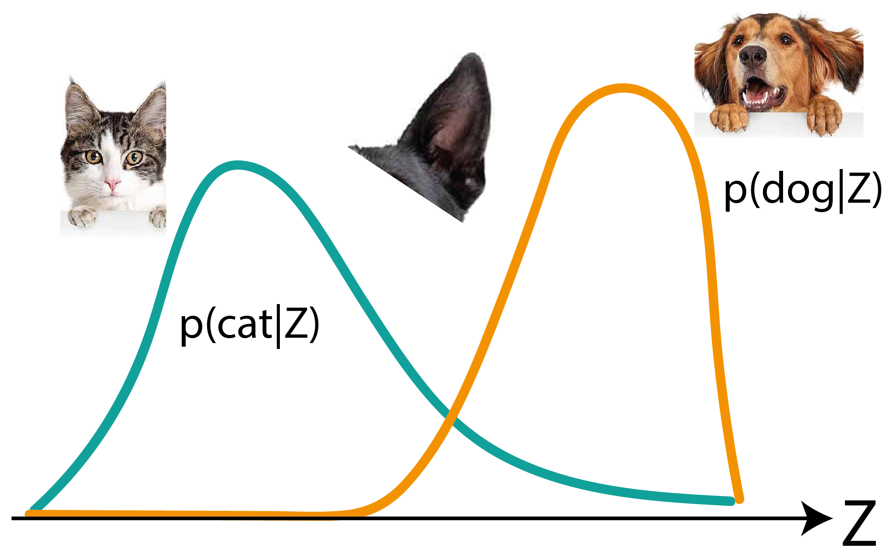
```

## Unsupervised learning

## Aim of unsupervised learning

- have training draws $(X_1,X_2,...,X_n)$
- aim to learn $p(X)$
- learning $p(X)$ is hard but can often use low-dimensional approximation:

\begin{equation}
\widehat p_\theta(Z) \approx p(X), 
\end{equation}

where $Z$ are features of $X$

## Practical aim of unsupervised learning
```{r, echo = FALSE, out.width = "800px",fig.align="center"}
  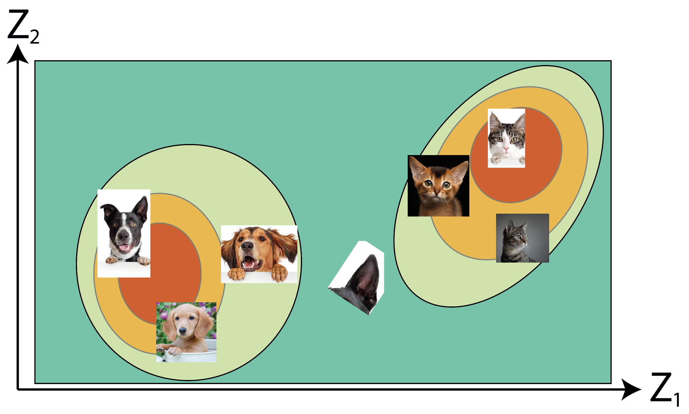
```

## Level 3: summary

- many unobserved factors lead to observed data $\implies$ probability distributions describe data generation
- both supervised and unsupervised learning attempt density estimation:
    - supervised tries to learn $p(y|X)$
    - unsupervised tries to learn $p(X)$

## Questions?

# Unsupervised learning

## Flavours of unsupervised learning

- dimensionality reduction
- clustering (really a type of dim. reduction)
- (outlier detection)

## Dimensionality reduction

## What is dimensionality reduction?

- most real life things have lots of features
- many features exhibit a degree of redundancy
- the effective number of important features is lower and we aim to identify these

## Why reduce dimensions?

- universe is complex
- science aims to understand constituent laws to simplify universe
- more parsimonious theories have greater information compression and tend to generalise better

## Why can dimensionality reduction help?

- improves interpretability
- aids visualisation
- extracts core features for supervised learning
- (lossy) information compression
- noise reduction

## Classes of dimensionality reduction

- projection
- manifold learning

## Wine data
```{r, echo = FALSE, warning=FALSE, message=FALSE}
knitr::opts_chunk$set(echo = TRUE)
library(tidyverse)
library(kableExtra)
df <- readRDS("data/winemag-data_first150k_10000.rds")%>% select(-description)
kable(df[1:100, ],format="html",escape = F, col.names = colnames(df)) %>% 
  kable_styling() %>%
  kableExtra::scroll_box(width = "100%", height = "400px")
```

# Projection

## Types

- Principal Components Analysis (PCA)
- Linear discriminant analysis
- Kernel PCA

## PCA

## Example raw data
```{r, echo = FALSE, out.width = "800px",fig.align="center"}
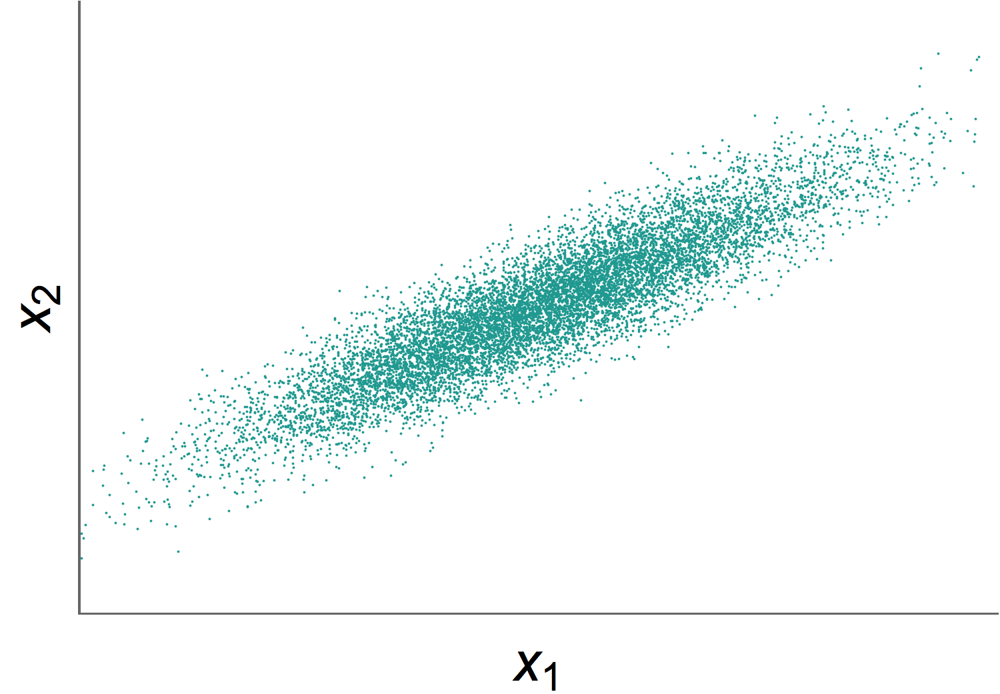
```

## Modelling data

- Looks normally distributed:

\begin{equation}
(x_1,x_2)' \sim \mathcal{N}(\mu, \Sigma)
\end{equation}

where $\Sigma$ is dense.

- Can we use this assumption to move to more natural coordinate system? I.e.

\begin{equation}
(y_1,y_2)' \sim \mathcal{N}(0, D)
\end{equation}

where $D$ is diagonal.

## Example raw data
```{r, echo = FALSE, out.width = "800px",fig.align="center"}

```

## Assumed generative model
```{r, echo = FALSE, out.width = "800px",fig.align="center"}
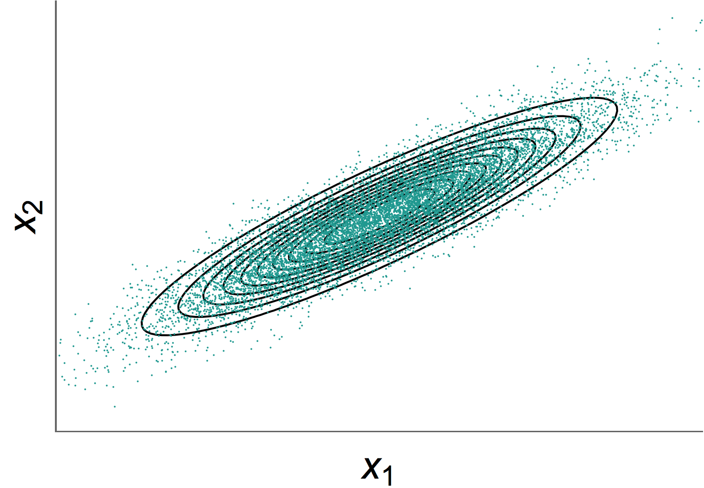
```

## 1st PC component axis
```{r, echo = FALSE, out.width = "800px",fig.align="center"}
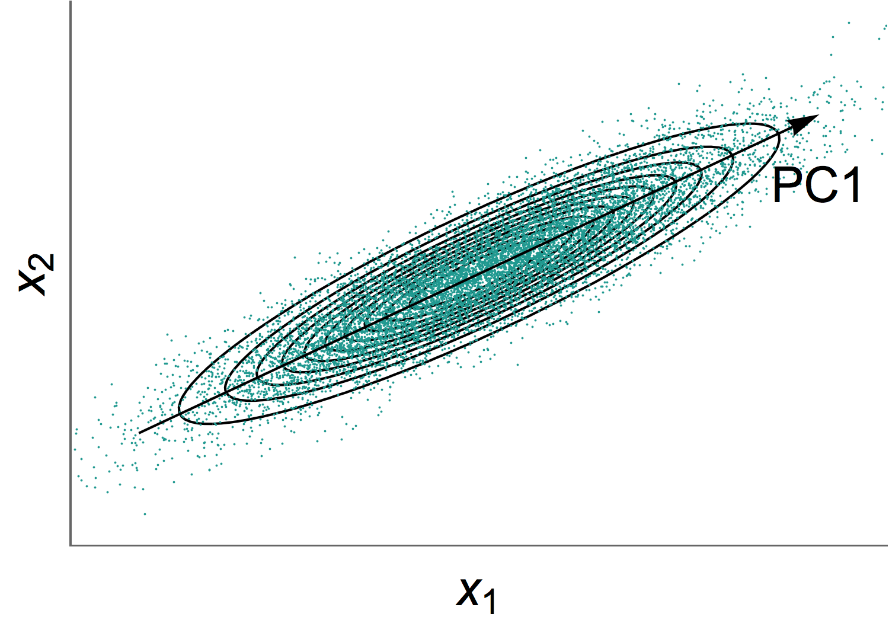
```

## 2nd PC component axis
```{r, echo = FALSE, out.width = "800px",fig.align="center"}
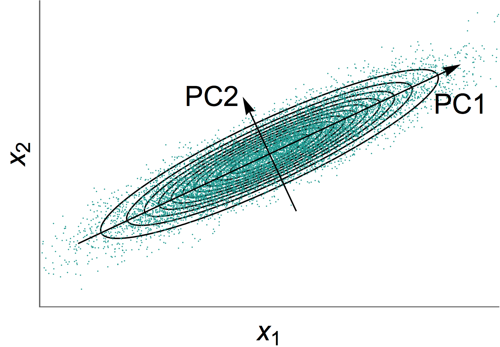
```

## How to obtain PC axes?

Remember, we've assumed:

\begin{equation}
(x_1,x_2)' \sim \mathcal{N}(\mu, \Sigma)
\end{equation}

1. Centre data:

\begin{equation}
(\tilde x_{1,i}, \tilde x_{2,i}) = (x_{1,i}, x_{2,i}) - (\bar x_{1}, \bar x_{2})
\end{equation}

2. Estimate covariance matrix:

\begin{equation}
\widehat{\Sigma} = \frac{1}{n}\sum (\tilde x_{1,i}, \tilde x_{2,i})' (\tilde x_{1,i}, \tilde x_{2,i})
\end{equation}

## How to obtain PC axes?

3. Eigendecompose:

\begin{equation}
\widehat{\Sigma} = P D P'
\end{equation}

- $P=[P_1, P_2]$ is matrix of eigenvectors of $\widehat{\Sigma}$ representing PC directions:

\begin{align}
y_1 &= P_1' . (\tilde x_1, \tilde x_2)\\
y_2 &= P_2' . (\tilde x_1, \tilde x_2)
\end{align}

- $D$ is diagonal with eigenvalues as diagonal elements
- eigenvector magnitudes indicate relative variance explained by that PC

## Apply PCA to wine data
```{r, echo = FALSE, warning=FALSE, message=FALSE}
library(kableExtra)
df <- readRDS("data/winemag-data_first150k_10000.rds") %>% 
  select(-description) %>% 
  mutate(review_id=seq_along(country))
kable(df[1:100, ],format="html",escape = F, col.names = colnames(df)) %>% 
  kable_styling() %>%
  kableExtra::scroll_box(width = "100%", height = "400px")
```

## Pick price and points
```{r, echo = FALSE, warning=FALSE, message=FALSE}
kable(df[1:100, ] %>% select(price, points),format="html",escape = F) %>% 
  kable_styling() %>%
  kableExtra::scroll_box(width = "100%", height = "400px")
```

## Plot price and points
```{r, echo = FALSE, warning=FALSE, message=FALSE}
df <- readRDS("data/winemag-data_first150k_10000.rds") %>% 
  mutate(review_id=seq_along(country))

df <- df[complete.cases(df), ] %>% 
  mutate(price=price,
         points=scale(points)[, 1])
df %>% 
  ggplot(aes(x=points, y=price)) +
  geom_jitter(colour="black") +
  xlim(-3.5, 4) +
  ylim(-20, 800)
```


## Apply PCA
```{r, echo = FALSE, warning=FALSE, message=FALSE}
df <- readRDS("data/winemag-data_first150k_10000.rds") %>% 
  mutate(review_id=seq_along(country))

df <- df[complete.cases(df), ] %>% 
  mutate(price=price,
         points=scale(points)[, 1])

x <- df %>% 
  select(price, points)
pca <- prcomp(x, center = T)

scores <- predict(pca, x)

df_temp <- df %>% cbind(scores)

f1 <- function(points) {
  v1 <- pca$rotation[, 1]
  m <- v1[1] / v1[2]
  c <- pca$center[1] - m * pca$center[2]
  return(m * points + c)
}

f2 <- function(points) {
  v1 <- pca$rotation[, 1]
  m <- v1[1] / v1[2]
  m <- -1 / m
  c <- pca$center[1] - m * pca$center[2]
  return(m * points + c)
}

df_temp %>% 
  ggplot(aes(x=points, y=price)) +
  geom_jitter(colour="black") +
  stat_function(fun=f1, colour="blue") +
  stat_function(fun=f2, colour="blue") +
  xlim(-3.5, 4) +
  ylim(-20, 800)
```

## What went wrong?

- PCA assumes data is distributed as multivariate normal
- price data very non-normal

```{r, echo = FALSE, warning=FALSE, message=FALSE, out.width = "600px",fig.align="center"}
df %>% 
  select(price, points, review_id) %>% 
  melt(id.vars="review_id") %>% 
  ggplot(aes(x=value)) +
  geom_histogram() +
  facet_wrap(~variable, scales="free")
```

## Take log transform of price
```{r, echo = FALSE, warning=FALSE, message=FALSE}
df %>% 
  select(price, points, review_id) %>% 
  mutate("log(price)" = log10(price)) %>% 
  select(-price) %>% 
  melt(id.vars="review_id") %>% 
  mutate(variable=fct_relevel(variable, "log(price)", "points")) %>% 
  ggplot(aes(x=value)) +
  geom_histogram() +
  facet_wrap(~variable, scales="free")
```

## Reapply PCA
```{r, echo = FALSE, warning=FALSE, message=FALSE}
df <- readRDS("data/winemag-data_first150k_10000.rds")
df <- df[complete.cases(df), ] %>% 
  mutate(price=log(price),
         points=scale(points)[, 1])

x <- df %>% 
  select(price, points)
pca <- prcomp(x, center = T)

scores <- predict(pca, x)

df_temp <- df %>% cbind(scores)

f1 <- function(points) {
  v1 <- pca$rotation[, 1]
  m <- v1[1] / v1[2]
  c <- pca$center[1] - m * pca$center[2]
  return(m * points + c)
}

f2 <- function(points) {
  v1 <- pca$rotation[, 1]
  m <- v1[1] / v1[2]
  m <- -1 / m
  c <- pca$center[1] - m * pca$center[2]
  return(m * points + c)
}

df_temp %>% 
  ggplot(aes(x=points, y=price)) +
  geom_point() +
  stat_function(fun=f1, colour="blue") +
  stat_function(fun=f2, colour="blue") +
  ylim(1.5, 5) +
  ylab("log(price)") +
  coord_fixed()
```

## Variance explained by each component
```{r, echo = FALSE, warning=FALSE, message=FALSE}
df <- readRDS("data/winemag-data_first150k_10000_processed.rds") %>% 
  filter(country %in% c("Italy", "France", "Germany")) %>% 
  droplevels()
x <- df %>% 
  select(price, points, contains("desc_"))
pca <- prcomp(x, scale. = T)

# Variation explained by different pcs
scores <- predict(pca, x)
pov <- pca$sdev^2/sum(pca$sdev^2)
pcs <- 1:9
tibble(variable=colnames(scores)[pcs],
       variance=pov[pcs]) %>% 
  ggplot(aes(x=variable, y=variance)) +
  geom_col() +
  scale_y_continuous(labels=scales::percent)
```

## What do PCs mean?
```{r, echo = FALSE, warning=FALSE, message=FALSE}
loadings <- pca$rotation %>% 
  as.data.frame() %>% 
  rownames_to_column()

loadings %>% 
  select(PC1, PC2, rowname) %>% 
  melt(id.vars="rowname") %>% 
  ggplot(aes(x=rowname, y=value)) +
  geom_col() +
  coord_flip() +
  facet_wrap(~variable)
```


## Project data onto first two PCs
```{r, echo = FALSE, warning=FALSE, message=FALSE}
df_temp <- df %>% cbind(scores)

df_temp %>% 
  ggplot(aes(x=PC1, y=PC2, colour=country)) +
  geom_point() +
  theme(legend.text = element_text(size=16),
        legend.title = element_text(size=16))
```

## PCA: summary

- PCA is a projection method using linear transformations: collectively those linear transformations represent a rotation of coordinate axes
- PCA assumes data are multivariate normal
    - if not a good approximation, components can be poor representation
- works ok for simple data; less well for non-linear features

## Questions?

# Manifold learning

## What is it?

Essentially these methods try to learn the structure of the local manifolds in the data. (Also referred to as graph-based or embedding methods.)

- t-distributed stochastic nearest neighbour embedding (t-SNE)
- uniform manifold approximation and projection (UMAP)

# t-distributed stochastic nearest neighbour embedding

## High level detail

- original data in "data space" of dimensions $\mathbb{R}^k$, where $k$ is quite large
- t-SNE transforms data non-linearly to a "map space" of dimensions $\mathbb{R}^2$ or $\mathbb{R}^3$ typically
- constructs the mapping such that points close in "data space" are also close in "map space"

## Mapping tries to preserves local neighbours
```{r, echo = FALSE, out.width = "1000px",fig.align="center"}
  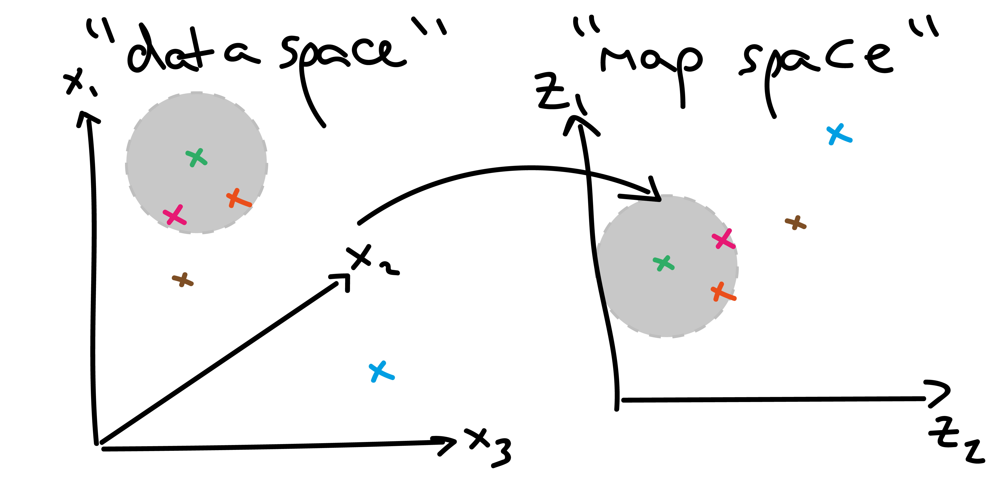
```

## Similarity in data space: fuzzy neighbours

- imagine a Gaussian density around each point and define a conditional similarity:

\begin{equation}
p_{j|i} = \frac{\exp(-|x_i-x_j|^2/2\sigma_i^2)}{\sum_{k\neq i} \exp(-|x_i-x_k|^2/2\sigma_i^2)}
\end{equation}

where $\sigma_i$ is different for each point: points in dense areas given smaller variance than those in sparse areas

- $p_{j|i}$ measures the probability that $x_i$ would pick $x_j$ as its neighbour

## Symmetrised similarity

Need a distance metric, so define:

\begin{equation}
p_{ij} = \frac{1}{N} (p_{j|i} + p_{i|j})
\end{equation}

yielding a similarity matrix with elements $p_{ij}$

## Similarity in map space

Uses Student-t distribution with one degree of freedom (the Cauchy):

\begin{equation}
q_{ij} = \frac{1/(1+|z_i-z_j|^2)}{\sum_{k\neq i} 1/(1+|z_i-z_k|^2)}
\end{equation}

## How to choose $z_i$?

```{r, echo = FALSE, out.width = "800px",fig.align="center"}
  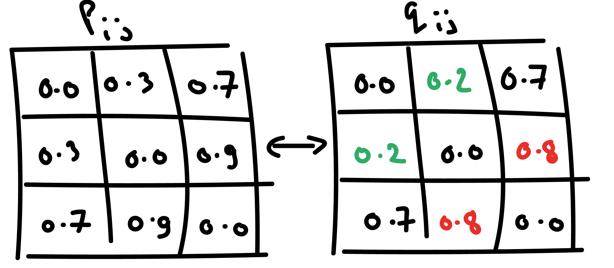
```

## Algorithm to choose $z_i$

We can calculate the Kullback-Leibler divergence (not a distance!) from $p_{ij}\rightarrow q_{ij}$:

\begin{equation}
\text{KL} = \sum_{i,j} p_{ij} \log \frac{p_{ij}}{q_{ij}}
\end{equation}

Minimise via gradient descent using $\frac{\partial \text{KL}}{\partial z_i}$

## Picking $\sigma_i$

- more uncertainty (i.e. entropy) if $\sigma_i\uparrow$
- user specifies a "perplexity" hyperparameter which effectively determines number of nearest neighbours
- t-SNE chooses $\sigma_i$ to meet this perplexity for each data point

## Applying t-SNE to wine data

## Perplexity=1
```{r, echo = FALSE, warning=FALSE, message=FALSE}
df <- readRDS("data/winemag-data_first150k_10000_processed.rds") %>%
  filter(country %in% c("Italy", "France", "Germany")) %>%
  droplevels()
x <- df %>%
  select(price, points, contains("desc_")) %>%
  unique()
df <- df[as.numeric(row.names(x)), ]
# library(Rtsne)
# tsne <- Rtsne(x, dims=2, perplexity=1, verbose=FALSE, max_iter = 500)
# saveRDS(tsne, "tsne_wine_1.rds")
tsne <- readRDS("data/tsne_wine_1.rds")
scores <- tsne$Y
colnames(scores) <- map_chr(1:2, ~paste0("Dim.", .))
df_temp <- df %>% cbind(scores)
df_temp %>% 
  ggplot(aes(x=Dim.1, y=Dim.2, colour=country)) +
  geom_point() +
  theme(legend.text = element_text(size=16),
        legend.title = element_text(size=16))
```

## Perplexity: 100
```{r, echo = FALSE, warning=FALSE, message=FALSE}
# library(Rtsne)
# tsne <- Rtsne(x, dims=2, perplexity=100, verbose=FALSE, max_iter = 500)
# saveRDS(tsne, "data/tsne_wine_100.rds")
tsne <- readRDS("data/tsne_wine_100.rds")
scores <- tsne$Y
colnames(scores) <- map_chr(1:2, ~paste0("Dim.", .))
df_temp <- df %>% cbind(scores)
df_temp %>% 
  ggplot(aes(x=Dim.1, y=Dim.2, colour=country)) +
  geom_point() +
  theme(legend.text = element_text(size=16),
        legend.title = element_text(size=16))
```

# Summary

## Summary

- unsupervised and supervised learning aim to achieve different goals
- dimensionality reduction is one variety of unsupervised learning
- PCA is a linear projection method
- t-SNE and UMAP are (non-linear) manifold learning methods that can better approximate lower dimensional approximations

## Summary

- clustering methods can reduce data down to a single dimension
- k-means works for simple datasets
- GMMs are model-based and more general (but still have flaws)

# Supervised ML

# Linear regression

## Example data

```{r, echo = FALSE, out.width = "1000px",fig.align="center"}
  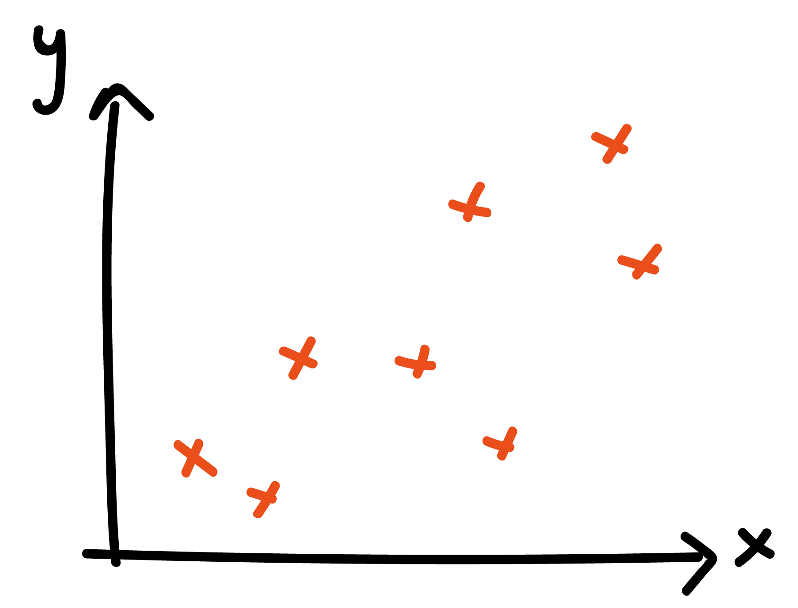
```

## Probabilistic model

Suppose

\begin{equation}
y_i|x_i \sim \mathcal{N}(\alpha + \beta x_i, \sigma),
\end{equation}

where $(\alpha, \beta, \sigma)$ are parameters to be learned

## What does this model look like?

```{r, echo = FALSE, out.width = "1000px",fig.align="center"}
  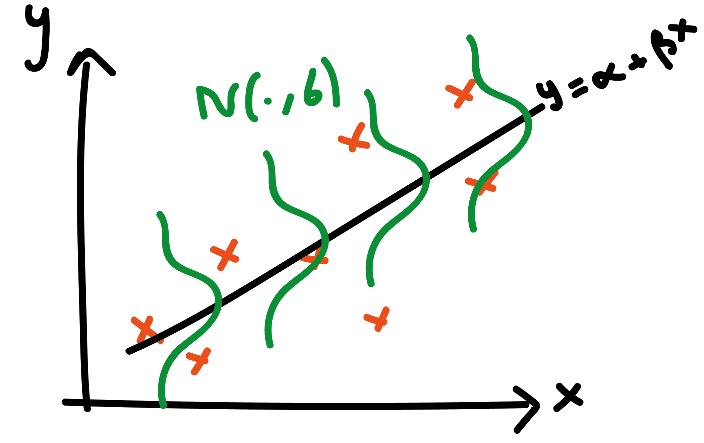
```

## How to estimate model?

assume $\boldsymbol{y}=(y_1,y_2,...,y_K)$ and $\boldsymbol{x}=(x_1,x_2,...,x_K)$ 

\begin{equation}
p(\alpha,\beta,\sigma|\boldsymbol{y},\boldsymbol{x}) \propto p(\boldsymbol{y}|\boldsymbol{x},\alpha, \beta,\sigma) p(\alpha,\beta,\sigma)
\end{equation}

use these to determine posterior predictive distribution describing new $\tilde{\boldsymbol{y}}$ for given (new) $\tilde{\boldsymbol{x}}$:

\begin{equation}
p(\tilde{\boldsymbol{y}}|\tilde{\boldsymbol{x}}) = \int p(\tilde{\boldsymbol{y}}|\tilde{\boldsymbol{x}},\alpha, \beta,\sigma) p(\alpha,\beta,\sigma|\boldsymbol{y},\boldsymbol{x}) d\alpha\;d\beta\;d\sigma
\end{equation}

typically would be done via Markov chain Monte Carlo

## Alternative (non-probabilistic) model

\begin{equation}
y_i = \alpha + \beta x_i + \epsilon_i
\end{equation}

where $\epsilon_i$ is an error term. Define mean-squared loss:

\begin{equation}
L = \frac{1}{K} \sum_{i=1}^{K} (y_i - (\alpha + \beta x_i))^2
\end{equation}


## What does this model look like?

```{r, echo = FALSE, out.width = "1000px",fig.align="center"}
  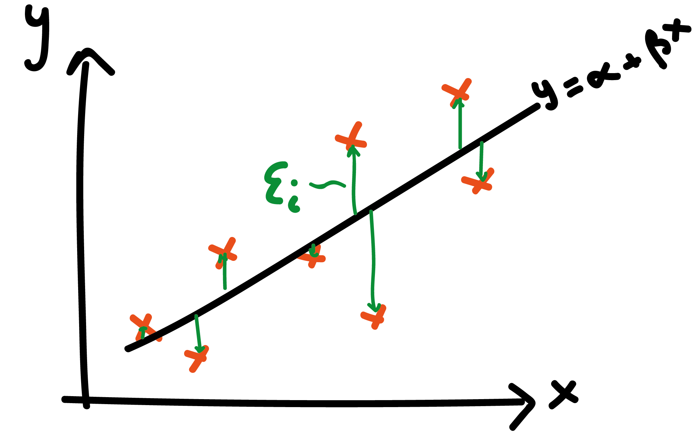
```

## Learning parameters

determine $\hat{\alpha}$ and $\hat{\beta}$ as those minimising $L$:

\begin{align}
\frac{\partial L}{\partial \alpha} &= -\frac{2}{K}\sum_{i=1}^{K} (y_i - (\alpha + \beta x_i)) = 0\\
\frac{\partial L}{\partial \beta} &= -\frac{2}{K}\sum_{i=1}^{K} x_i (y_i - (\alpha + \beta x_i)) = 0
\end{align}

## Gradient descent

although a closed form expression exists for $\hat{\alpha}$ and $\hat{\beta}$, for more general models, one doesn't exist $\implies$ use gradient descent optimisation

1. initialise parameters $\alpha=\alpha_0$, $\beta=\beta_0$
2. in each epoch update parameters:

\begin{align}
\alpha &= \alpha - \eta \frac{\partial L}{\partial \alpha}\\
\beta &= \beta - \eta \frac{\partial L}{\partial \beta}
\end{align}

until $\alpha$ and $\beta$ no longer change. $\eta$ is the learning rate

## Linear regression with polynomial terms

alternative model:

\begin{equation}
y_i|x_i \sim \mathcal{N}(f_p(x_i), \sigma),
\end{equation}

where

\begin{equation}
f_p(x_i) = \theta_0 + \theta_1 x_i + \theta_2 x_i^2 + ... + \theta_p x_i^p
\end{equation}

model is better able to fit more complex datasets

## Is this a good fit?

```{r, echo = FALSE, out.width = "1000px",fig.align="center"}
  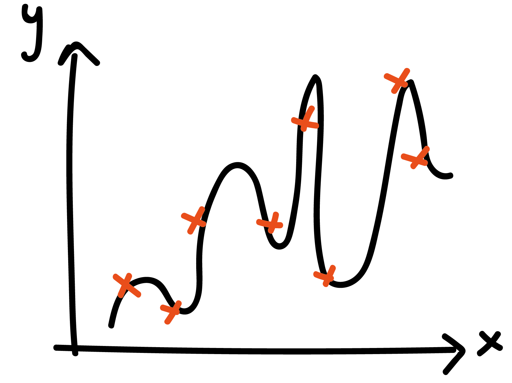
```

## What went wrong?

- adding more parameters always reduces error on training set
- but results in a model that generalises poorly

## What is a good fitting model?

```{r, echo = FALSE, out.width = "1000px",fig.align="center"}
  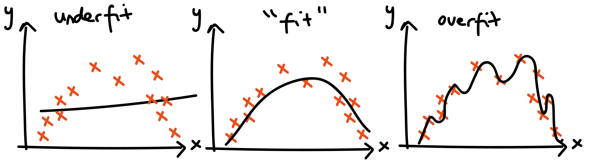
```

## Solutions

- need a separate validation set (more this afternoon) to test model predictions on
- regularisation can help too, yielding a new objective function:

\begin{equation}
L = C||\theta||_q + \frac{1}{K} \sum_{i=1}^{K} (y_i - f_p(x_i))^2
\end{equation}

where $||.||_q$ denotes the $Lq$ norm: different choices can yield very different estimates

## Linear regression summary

- linear regression defines a loss function (typically mean squared error) between actual and predicted observations
- training can be done via gradient descent: each epoch corresponds to a single parameter update
- (gradient descent also used to train many other methods, like neural nets)
- fitting regression with more complex functional forms can fit more complex data
- but risks poor generalisation

# Logistic regression

## Logistic regression

- confusingly, this is a classifier not a regression (in the ML sense)
- models data as generated from a Bernoulli probability distribution
- probability parameter of Bernoulli modelled by logistic function, hence the name
- simple classifier but yields interpretable results and can be estimated in Bayesian framework

## Model for binary data

- suppose we have many labelled tuples of $(x_{i}, y_i)$
- where $y_i$ is binary: here, we set $y_i=0$ for one category; $y_i=1$ for the other
- since outcome is binary $\implies$ use an appropriate probability distribution:

\begin{equation}
y_i \sim \text{Bernoulli}(\theta_i)
\end{equation}

where $0\leq \theta_i \leq 1 = Pr(y_i=1)$

## Bernoulli probability distribution

is given by:

\begin{equation}
\text{Pr}(y_i|\theta_i) = \theta_i^{y_i} (1 - \theta_i)^{1 - y_i}
\end{equation}

so that $\text{Pr}(y_i=1) = \theta_i$ and $\text{Pr}(y_i=0) = 1 - \theta_i$

## Logistic function

In logistic regression, we use logistic function:

\begin{equation}
\theta_i = f_\beta(x_i) := \frac{1}{1 + \exp (-(\beta_0 + \beta_1 x_i))}
\end{equation}

```{r, echo = FALSE, out.width = "600px",fig.align="center"}
  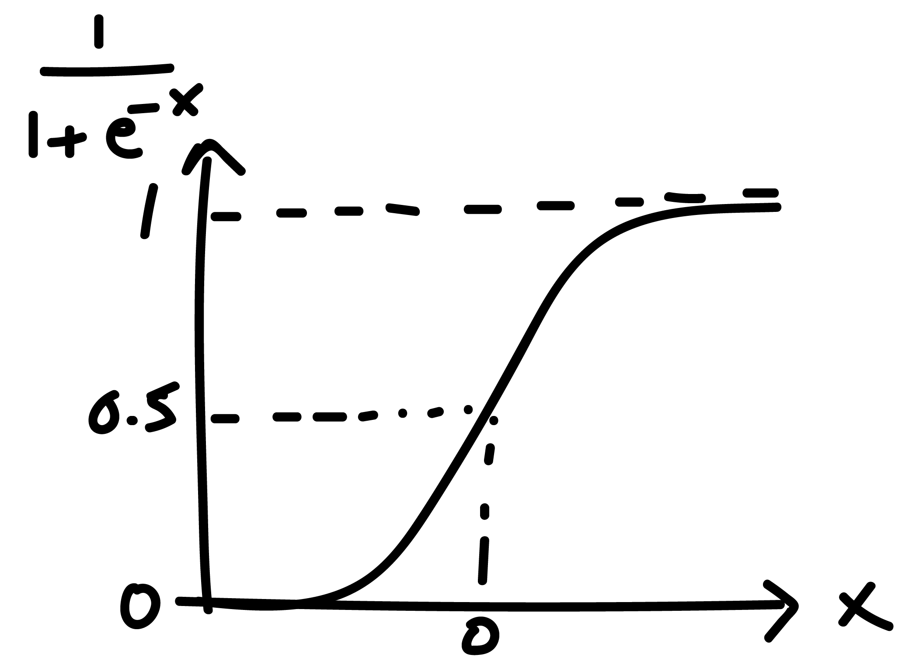
```

## Likelihood and Bayesian estimation

assume data are i.i.d., the likelihood is:

\begin{equation}
L=p(\boldsymbol{y}|\beta,\boldsymbol{x}) = \prod_{i=1}^{K} f_\beta(x_i)^{y_i} (1 - f_\beta(x_i))^{1 - y_i}
\end{equation}

setting priors, we have a Bayesian model:

\begin{equation}
p(\beta|\boldsymbol{x}, \boldsymbol{y}) \propto p(\beta) p(\boldsymbol{y}|\beta,\boldsymbol{x})
\end{equation}

so can use (say) Markov chain Monte Carlo to estimate model with uncertainty. Frequentists use gradient descent to find maximum likelihood estimates instead

## Multivariate logistic regression

straightforward to extend the model to incorporate multiple regressions:

\begin{equation}
f_\beta(x_i) := \frac{1}{1 + \exp (-(\beta_0 + \beta_1 x_{1,i} + ... + \beta_p x_{p,i}))}
\end{equation}

But how to interpret parameters of logistic regression?

## Log-odds ratios

another way of writing logistic function:

\begin{align}
f_\beta(x_i) &= \frac{1}{1 + \exp (-(\beta_0 + \beta_1 x_{1,i} + ... + \beta_p x_{p,i}))}\\
&= \frac{\exp (\beta_0 + \beta_1 x_{1,i} + ... + \beta_p x_{p,i})}{1 + \exp (\beta_0 + \beta_1 x_{1,i} + ... + \beta_p x_{p,i})}
\end{align}

so that

\begin{align}
1 - f_\beta(x_i) = \frac{1}{1 + \exp (\beta_0 + \beta_1 x_{1,i} + ... + \beta_p x_{p,i})}
\end{align}

## Log-odds ratios

taking the ratio:

\begin{equation}
\text{odds} = \frac{f_\beta(x_i)}{1-f_\beta(x_i)} = \exp (\beta_0 + \beta_1 x_{1,i} + ... + \beta_p x_{p,i})
\end{equation}

so that

\begin{equation}
\log\text{odds} =\beta_0 + \beta_1 x_{1,i} + ... + \beta_p x_{p,i}
\end{equation}

meaning (say) $\beta_1$ represents the change in log-odds for a one unit change in $x_{1}$

## Logistic regression summary

- logistic regression models are binary classifiers (in ML speak)
- assumes Bernoulli distribution for outputs
- logistic function used to relate changes in inputs to outputs
- estimatable via Bayesian inference
- multivariate logistic regression is a commonly used tool

## Questions?

---


